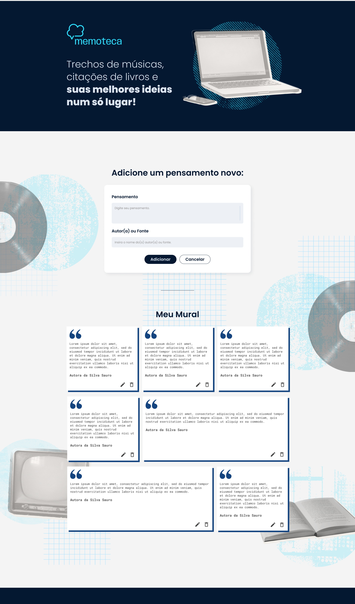

# Memoteca

Este projeto faz parte do meu aprendizado de JavaScript, curso da Alura: JavaScript: evoluindo a sua aplicação com ES6+ 

Neste projeto, desenvolvi uma plataforma para organização de pensamentos e frases, chamada **Memoteca**.

Link dos designs da aplicação: https://www.figma.com/design/OX90KoU3ie5aejFy4zTmz6/JavaScript--implementando-CRUD-com-requisi%C3%A7%C3%B5es-HTTP-%7C-Memoteca--Community-?node-id=148-26&p=f&t=sgcmzuQAdo5rQJ9Q-0

## Sobre o projeto



Memoteca é um aplicativo organizador de pensamentos e frases que permite cadastrar, listar, editar e deletar pensamentos, incluindo informações como conteúdo e autoria.

## Funcionalidades do projeto

1. Cadastro de pensamentos: permite adicionar novos pensamentos à lista, inserindo informações como conteúdo e autoria;
2. Listagem de pensamentos: exibe os pensamentos cadastrados, permitindo visualizar o texto e a autoria;
3. Edição de pensamentos: permite editar pensamentos existentes, atualizando as informações conforme necessário;
4. Exclusão de pensamentos: permite remover pensamentos da lista.

## Técnicas e Tecnologias

- `JavaScript`: linguagem de programação utilizada para desenvolver a lógica do aplicativo;
- `Fetch API`: utilizada para realizar requisições HTTP para comunicação com o servidor;
- `Axios`: biblioteca usada para facilitar e simplificar as requisições HTTP;
- `Node.js`: plataforma utilizada para executar o ambiente de desenvolvimento;
- `JSON Server`: utilizado para simular um backend e facilitar o desenvolvimento e teste das operações CRUD;
- `CSS`: utilizado para estilização da interface do aplicativo.

## Como Abrir e Rodar o Projeto

Para executar a API fake, você vai precisar do NodeJS; a versão utilizada foi a 20.12.2.

Instale o JSON Server globalmente (se ainda não estiver instalado):

```bash
npm install -g json-server
```

Para executar, abra um novo terminal e, dentro da pasta backend, execute:

```bash
npm start
```

Acesse o backend localmente em seu navegador:

http://localhost:3000

Para executar o frontend, abra o projeto no Visual Studio Code. Com a extensão Live Server instalada, clique com o botão direito no arquivo index.html e selecione "Open with Live Server" no menu de contexto.

Acesse o frontend localmente em seu navegador:

http://localhost:5500
